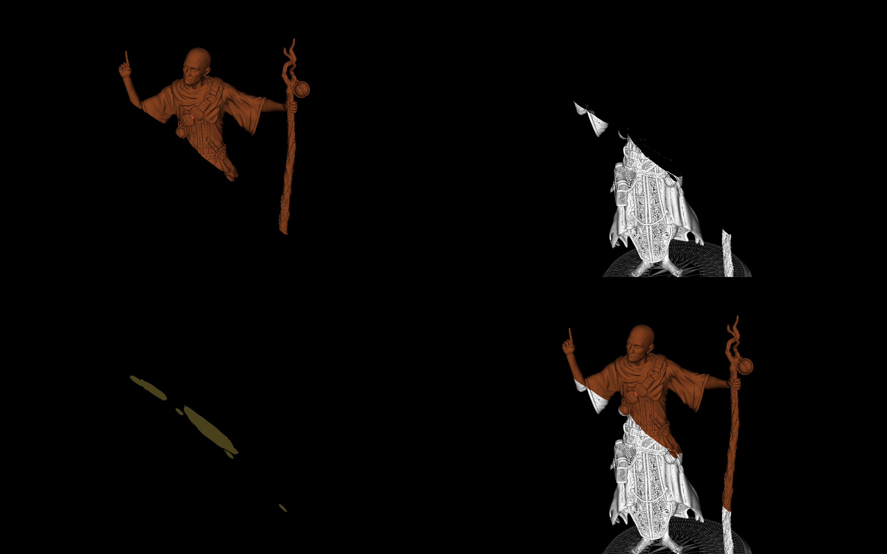
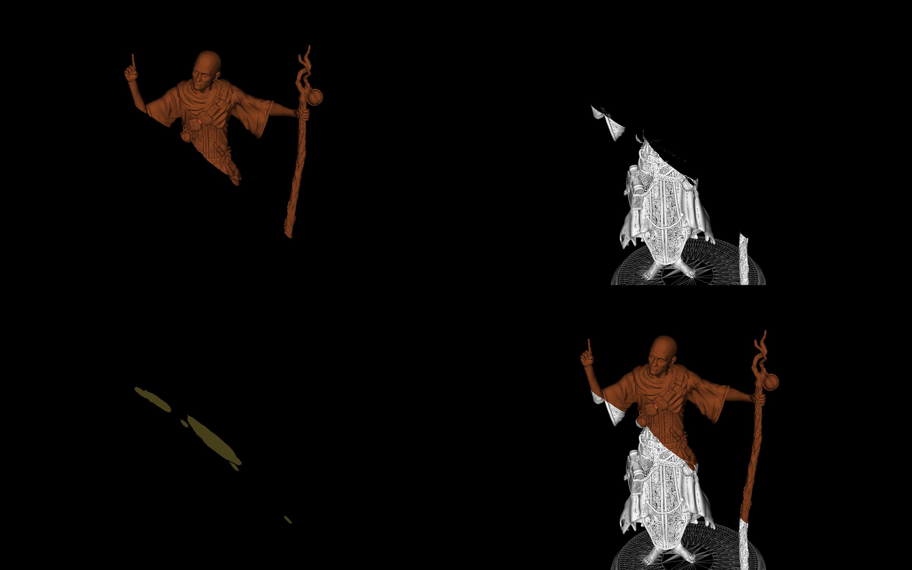
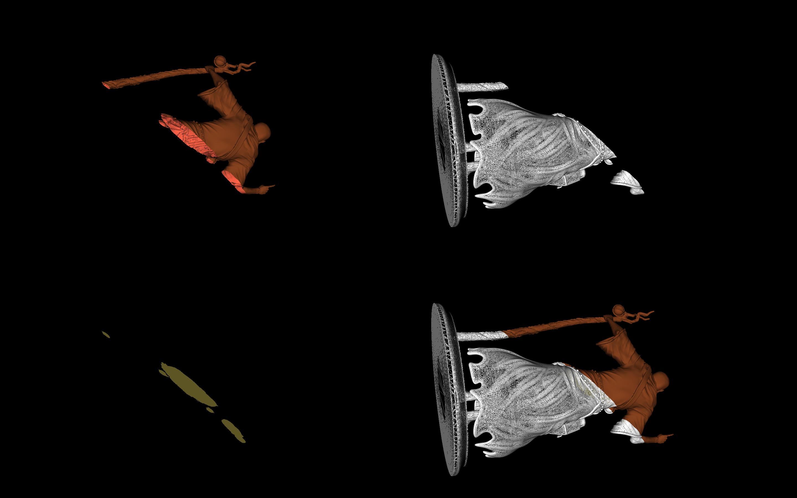

# MM - 804 Assignment 2
## Image description
Name - Warlock_repaired.stl

File size – 31,330 kb

Number of vertices on the original object = 319564

Number of vertices on the remaining part = 115705

Number of vertices on the clipped part = 209519

Number of vertices on the sliced area = 2830

## Requirements
vtk==9.1.0
python==3.8.8

## Steps to follow to execute
Download the required packages in your local system with the given command.

pip install -r requirements.txt

Then run python file using command:

python assignmentSolution.py

## Output
Once the above steps are executed the output obtained is as follows:

